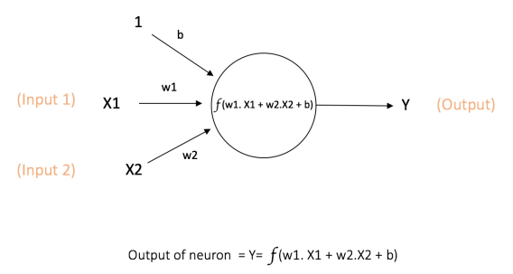

<!-- .slide: data-background-image="docs/figures/first_slide.jpg" -->

# Introduction to Neural Networks for time series

Artur Usov


---

## Agenda

* Feed Forward Neural Networks
* Long Short Term Memory Neural Networks
* Examples with Keras
---

<!-- .slide: data-background-image="docs/figures/robot2.gif" -->
## Neural Networks , a.k.a. AI & Deep Learning

---

## Feed Forward Neural Networks


Main Components:
* Neuron
* Activation Function
* Loss Function
* Backpropogation and Weights Adjustments
---


## Neuron



* w - Weights, b - bias, f - activation function
* Example: 2 features, hidden layer with 1 neuron
```
model = Sequential()
model.add(Dense(1, input_dim = 2)
```

---

## Activation Functions


* Selection depends on modeling objective
* Example: 2 features, hidden layer with 1 neuron and relu activation function
```
model = Sequential()
model.add(Dense(1, input_dim = 2, activation ='relu')
```

---

## Loss Functions

* Regression model: Mean Square Error
* Classification model: Cross-entropy
* Example: Regression model - use MSE
```
model = Sequential()
model.add(Dense(1, input_dim = 2, activation ='relu')
model.compile(loss='mse', optimizer='adam')
```

---

## Backpropagation


* Compute the loss and the derivative with respect to weights using the chain rule
* Update the weights in direction of lowering the Loss with step equal to learning rate
```
model = Sequential()
model.add(Dense(1, input_dim = 2, activation ='relu')
model.compile(loss='mse', optimizer='adam')
model.fit(X_train, Y_train, validation_data = (X_test, Y_test))
```

----

## RNN - LSTM

* Can we use NN for time series? Yes, with lagged target values as features, however network can not use its reasoning about previous events in the series to inform later ones
* Recurrent Neural Network: allows information to be passed from one step of the network to the next. Able to connect previous information to the present task
* LSTM remembers information for long period of time

----
## LSTM


* Pass feature information from state t to t+1. h - latent representation of inputs

----
## LSTM

             |  
:-------------------------:|:-------------------------:
 |  

----

## LSTM

Example:
* Using 5 previous target values are features
* Keras expects a 3d input: (N, Y_l, X_l) -> (N, 1, 5)
* (length training data, length of sequence we want to predict , number of features)
```
model = Sequential()
model.add(LSTM(10, input_shape = (1, 5)))
model.add(Dense(1, activation='linear'))
model.compile(optimizer='adam',loss='mse')
model.fit(X_train, Y_train, validation_data = (X_test, Y_test))
```

----
